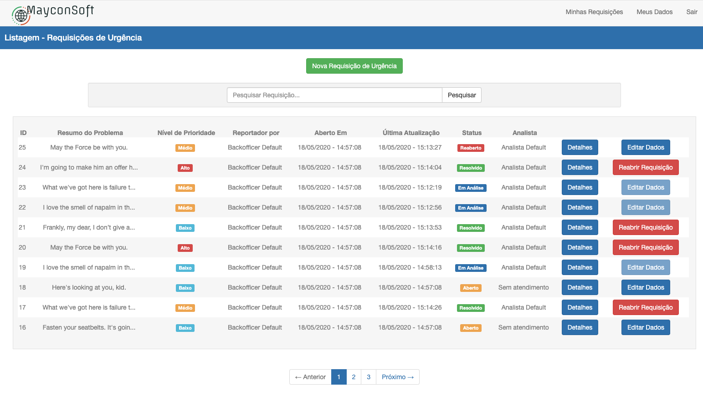
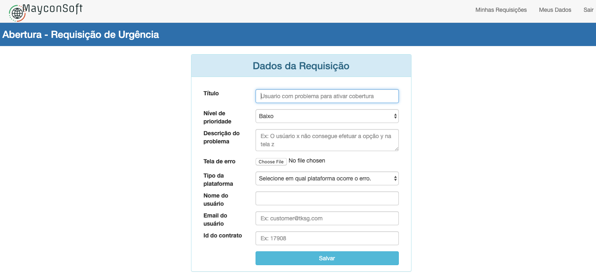

# Backofficer Incident
Software to control internal company incidents.

As `bacofficer`, is possible to set the urgency and to add information to a specific incident.

email: backofficer@company.com

password: backofficer_pass
- - - - -
As `analyst`, you can solve the incident or ask for more information about it.

analyst@company.com

password: analyst_pass

# Website Preview
Incidents List


- - - - -

Analyst page


- - - - -

Open new incident



## Ruby Verion
Ruby 2.7.0

## Rails Version
Rails 6.0.3

## Setup
Run in your console:
```
bin/setup
```
```
rails db:drop db:create db:migrate db:seed
```
